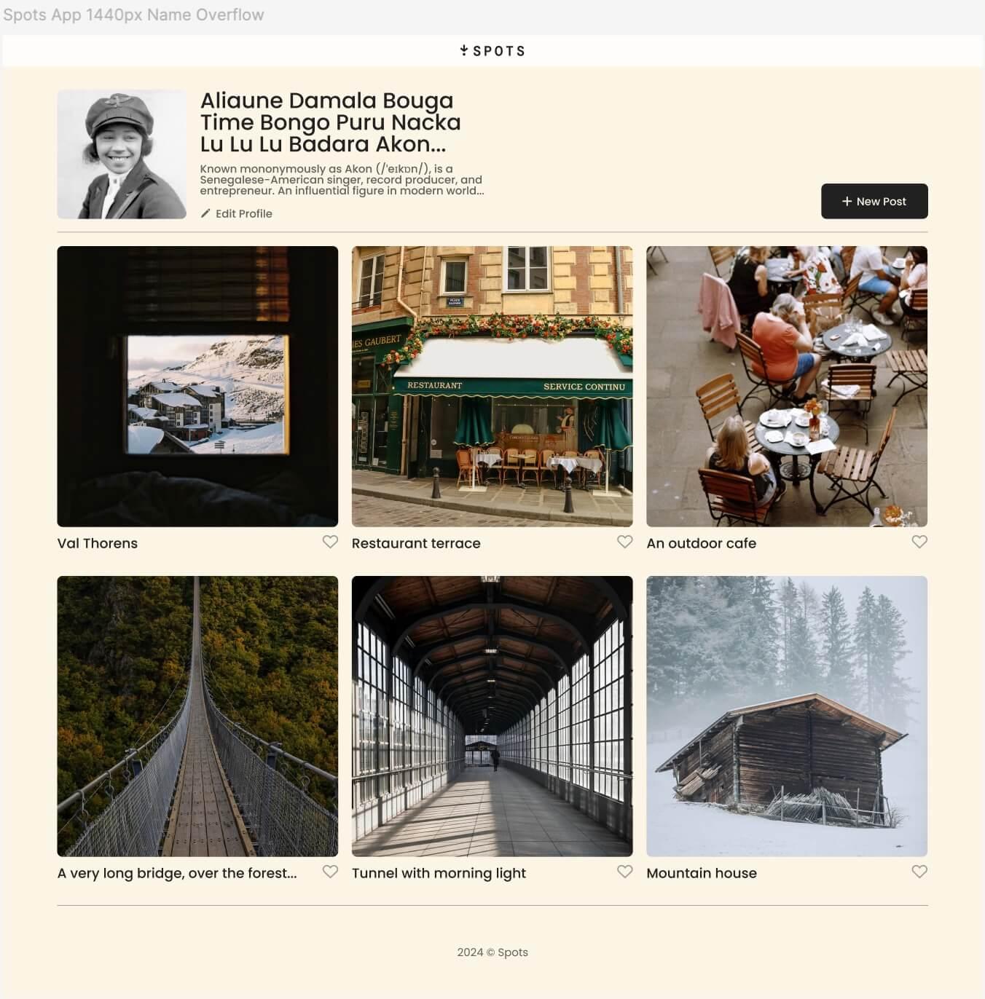
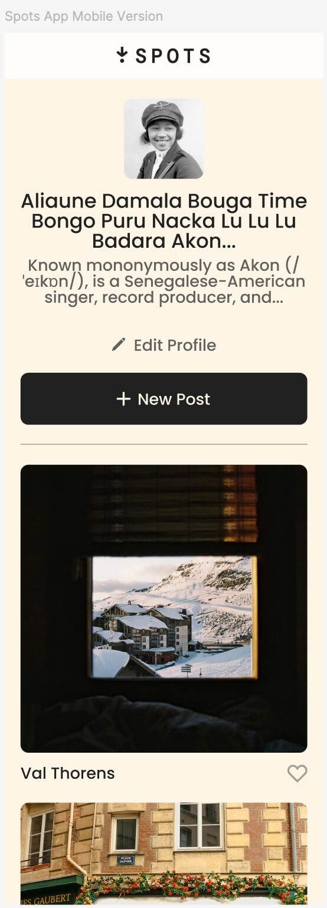

# Project 3: Spots

### Overview

- Project description
- Project features
- Images
- Plans for improvement
- Pages link
- Video

**Project description**

This is the Sprint 3 project of TripleTen's Software Engineering course. It's an interactive social media web application that allows users to add and remove photos, like photos, and make minor adjustments to their profile, such as editing their profile name.

It was created using HTML and CSS, based on a Figma design brief.

- [Link to the project on Figma](https://www.figma.com/file/BBNm2bC3lj8QQMHlnqRsga/Sprint-3-Project-%E2%80%94-Spots?type=design&node-id=2%3A60&mode=design&t=afgNFybdorZO6cQo-1)

**Project features**

- Semantic HTML5
- Flexbox
- Grid
- Exporting images from Figma
- Positioning
- BEM methodology

**Images**

- 
- 

**Plans for improvement**

- Increase the number of rows/columns allowed in the grid i.e. add more photo cards
- Add hyperlinks to the web application

**Pages link**

https://dshort13.github.io/se_project_spots/index.html

**Video**

https://drive.google.com/file/d/1xdyhMV43XztPjLO4LAWHbS9MJX7q3WJI/view?usp=sharing
